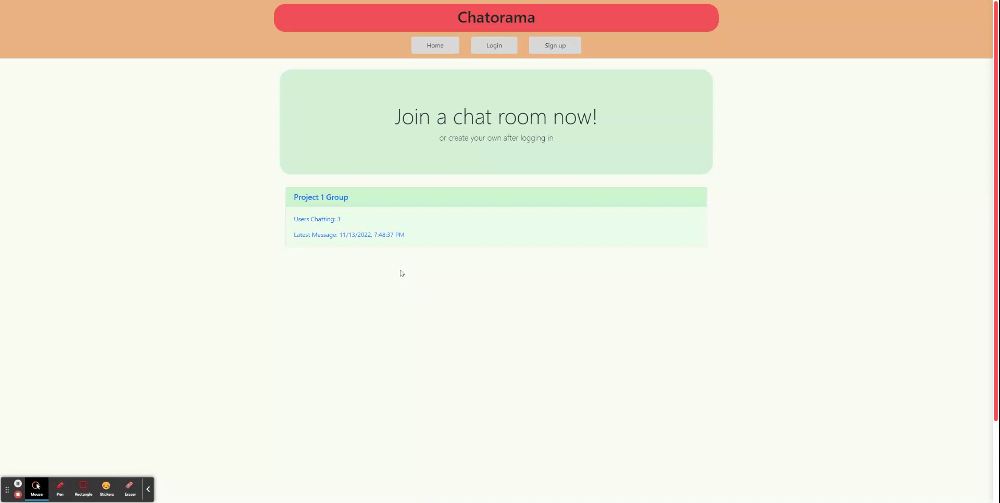
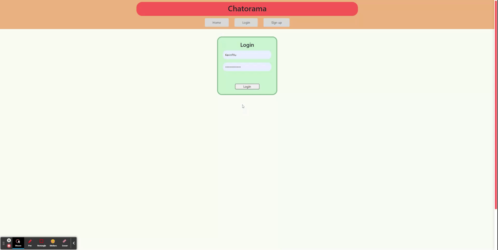
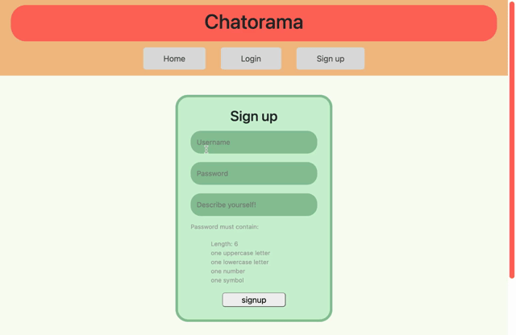
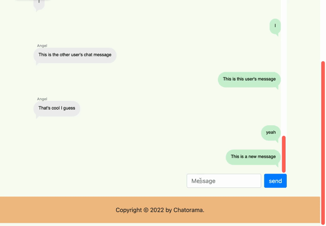
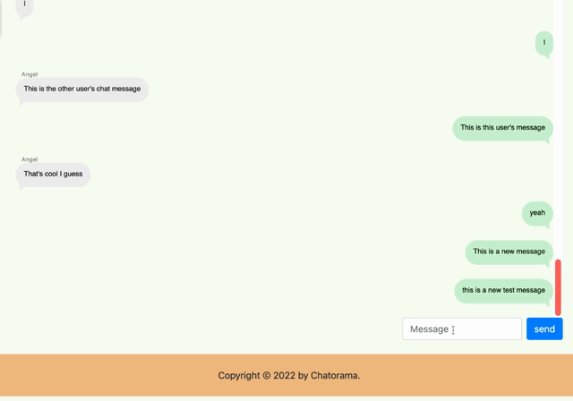

# Chatorama

## Description

Chatorama is a real-time messaging application to chat with all of your friends. From the homepage, users can view all chatrooms on the Chatorama website and join whichever room they choose to. Users can even create and delete their own chatrooms from the homepage and profile page respectively. 

Chatorama uses technologies like Node.js, Express.js, Sequelize, and Socket.io to give the website databases and server functionality. In addition, it uses handlebars templates to render the contents of the webpages. For more information about the technologies used, see the [Technologies Used](#technologies-used) section of this readme.

## Why?

We were looking to create a functioning chat room site similar to how group chats function on discord, slack, and imessages.
Where our app differs from most messaging apps is the functionality that allows any user to join any chat whenever they would like to without having to be added by someone else!

## Features

- User Login and Logout (Session and Cookies)
- Functional API calls
- Send and recieve messages in real-time
- Fully Responsive

## Table of Contents

- [Installation](#installation)
- [Usage](#usage)
- [Technologies Used](#technologies-used)
- [Collaborators](#Collaborators)
- [License](#license)

## Technologies Used

### FrontEnd
- HTML
- CSS
- Javascript 
- Fetch
- Web API
- CSS Framework - Bootstrap
- Wireframe Tool - Figma
- Session Storage

### BackEnd
- Node
- NPM
- Express
- Express-sessions
- MySQL
- Sequelize ORM  
- Bcrypt
- User Authentication - validation
- Handlebars
- Socket.io

## User Stories

As a user, I want to load the homepage and see all the resulting chat rooms created previously, When I click on a chatroom and I am not logged in, it will take me to a login screen.

Once I login, I am taken back to the home page and am able to select a chatroom to join. Once I click on the chat room, I am taken to that specific room and can immediately start chatting

When I am logged in, I want to be able to create a new chat room on the homescreen and have others be able to join from the homepage.

When I do not have an account yet, I want to be able to click on the signup and create an account with a profile.

As a logged in user, I want to be able to send a message so that I can communicate with other users in the chat room

As a logged in user, I want to see messages populate the page as messages are sent in so that I don’t have to refresh every time I think a message might have been sent

## Installation

- Create a new repository on your GitHub account.
- Clone this repository to modify the files and images as required.
- Push your changes to your GitHub repository.
- Deploy to your preferred hosting service.

## Usage

This repository can be used on both desktop and mobile after the installation process is followed.

If you would like to use an already deployed version of Chatorama, visit [our website](https://morning-ridge-00973.herokuapp.com/).

## Collaborators

- [Angel Cervantes](https://github.com/Angellyn218)
- [Carlos Martinez](https://github.com/carmart7)
- [Kevin Xu](https://github.com/KevinPXu)

## License

This project is licensed under the [MIT](./LICENSE) license.